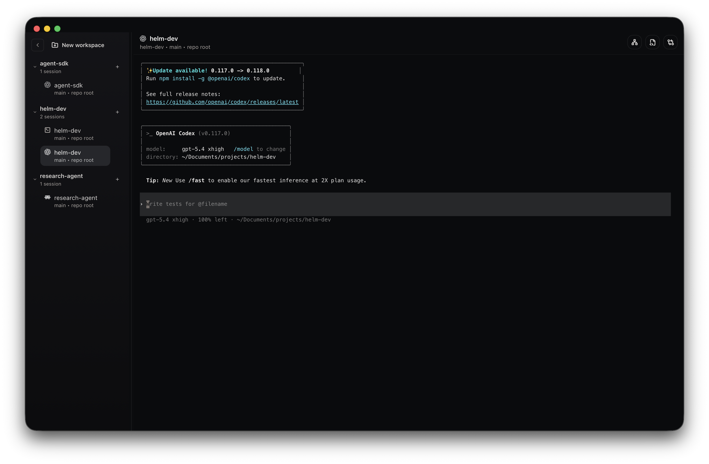
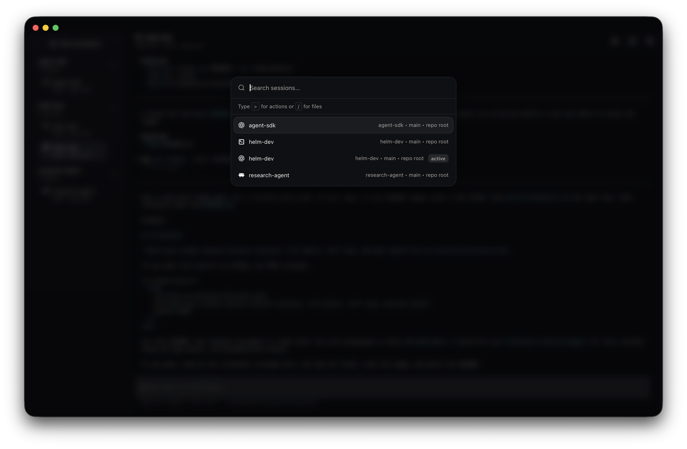

# Helm

Helm is a desktop app for terminal-first agentic engineering. It keeps agent sessions, workspace navigation, quick file edits, diffs, and peer coordination in one native desktop shell so you can stay in flow without bouncing between a terminal, editor, git client, and chat tools.

Helm is currently pre-1.0 and tracked at version `0.1.0`.

## Highlights

- Terminal-first agentic engineering for local workspaces and git worktrees
- Compact native desktop app with current macOS DMG downloads around `12 MB` and the extracted `.app` around `28 MB`
- Low-memory runtime designed for long-lived, multi-session work
- Multi-session workspaces with fast keyboard navigation between sessions
- Lightweight built-in file editor for quick changes without leaving the app
- Built-in diff view for staged, unstaged, and untracked changes
- Helm peer network for agent-to-agent communication and coordination

## Screenshots

<p align="center">
  
</p>

<p align="center"><em>Main workspace view with repo navigation and an active session.</em></p>

<p align="center">
  
</p>

<p align="center"><em>Command palette for fast file search and session switching.</em></p>

## Why Helm

Helm is built for engineers who want AI agents and shell-based development to stay close together. Instead of turning the terminal into a side panel inside a heavy IDE, Helm keeps the terminal at the center and adds just enough surrounding tooling to make multi-agent work practical.

That means you can keep multiple sessions open, jump between workspaces and worktrees, review diffs, make small file edits, and coordinate with other peer-aware agents from one desktop app.

## Core Features

### Multi-Session Workspaces

Run multiple terminal or agent sessions against the same repo, separate git worktrees, or different local workspaces. Helm keeps session and UI state across restarts so you can get back to work quickly.

### Lightweight File Editor

Open files directly from the active worktree and make quick edits in the built-in editor. It is intentionally lightweight: enough for focused fixes and review-driven changes without pulling you out of the terminal workflow.

### Built-In Diff View

Inspect staged, unstaged, and untracked changes from the active worktree inside Helm. The diff view is designed for fast review loops while you are actively driving sessions in the terminal.

### Helm Peer Network

Helm includes a local peer network for sessions that support peer messaging, making agent-to-agent communication a first-class part of the app instead of an external workflow.

- Live peer roster with repo and worktree context
- In-app inbox for recent messages, unread work, and outstanding requests
- Session summaries so each agent can advertise what it is working on
- Local peer state persisted across restarts
- Built-in peer CLI for listing peers, sending messages, reading inbox state, acknowledging messages, and publishing summaries

### Native and Efficient

Helm uses a Go backend with Wails, React, and xterm.js to keep the app fast and compact. The current macOS release DMG in `build/bin` is about `12 MB`, while the extracted `.app` bundle is about `28 MB` on disk. The app is designed to stay light on memory compared with heavier IDE-style setups.

## Stack

- Go `1.24+`
- Wails `v2`
- React + TypeScript + Vite
- SQLite for local persistence

## Prerequisites

- Go `1.24+`
- Node.js `18+` and `npm`
- Wails CLI

Install Wails:

```bash
go install github.com/wailsapp/wails/v2/cmd/wails@latest
```

## Local Development

Install frontend dependencies:

```bash
cd frontend
npm install
```

Run the desktop app in development mode from the repo root:

```bash
wails dev
```

This starts the Wails app plus the Vite dev server for fast frontend iteration.

## Configuration and State

Helm stores its local state and optional agent configuration under `os.UserConfigDir()/helm`.

- macOS: `~/Library/Application Support/helm/`
- Linux: `~/.config/helm/`
- Windows: `%AppData%\\helm\\`

The main files in that directory are:

- `state.db`: persisted UI state, session history, and peer state
- `agents.json`: optional custom agent definitions merged with the built-in adapters

## Peer CLI

Helm exposes peer commands through the desktop binary rather than a separately installed global `helm` command.

During local development, run peer commands from the repo root with:

```bash
go run . peers --help
```

From a built app, invoke the bundled executable directly:

```bash
<path-to-Helm-binary> peers --help
```

Inside Helm-managed peer-enabled sessions, Helm also injects a `helm` wrapper onto `PATH`, so in-session prompts may use commands such as `helm peers inbox --message-id <id>`.

## Verification

Run the backend tests:

```bash
go test ./...
```

Build the frontend bundle:

```bash
cd frontend
npm run build
```

Build a production app bundle:

```bash
wails build -clean
```

## Project Layout

- `main.go` and `app.go`: Wails app entrypoints and backend bindings
- `internal/session/`: session lifecycle, worktree management, diffs, and persisted app state
- `internal/peer/`: peer messaging runtime and CLI helpers
- `frontend/src/`: React application shell, terminal UI, file editor, diff view, and peer panel
- `build/`: platform packaging assets for macOS and Windows
